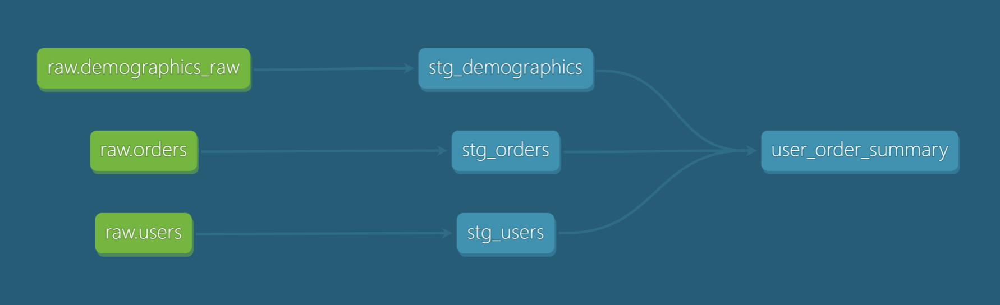

# dbt User Orders Analytics Project

## Overview

This project demonstrates a full data engineering pipeline from transactional source data to analytics-ready models. It uses PostgreSQL as the OLTP source, StreamSets for ingestion, Snowflake RAW storage, and dbt for transformation into MARTS.

Key capabilities:
- StreamSets-based ingestion
- Separation of RAW, STAGING, and MARTS layers
- Structured and semi-structured data handling
- dbt model orchestration and testing
- Analytics-ready summary model

## Architecture

### High-Level Flow

```text
CSV -> PostgreSQL -> StreamSets -> Snowflake (RAW) -> dbt -> ANALYTICS
```

### System Design

1. Source Layer (OLTP)
   - PostgreSQL stores transactional `users` and `orders`
   - Simulates operational application data
   - Keeps OLTP workload separate from analytics

2. Ingestion Layer
   - StreamSets extracts data from PostgreSQL
   - Loads into Snowflake RAW schema
   - Preserves source fidelity while enabling downstream transformation

3. Data Warehouse Layer
   - Snowflake RAW schema stores ingested tables
   - dbt builds STAGING and MARTS layers from RAW

4. Transformation Layer
   - dbt materializes staging models and analytics marts
   - Produces the final summary table in ANALYTICS

## Ingestion

### StreamSets Pipeline

StreamSets is used to move data from PostgreSQL into Snowflake RAW. It provides:
- pipeline orchestration
- batching and streaming capabilities
- monitoring and error handling
- schema handling and metadata enrichment

### Ingestion Flow

Each source dataset is ingested through a dedicated pipeline:

```text
JDBC Query Consumer -> Expression Evaluator -> Snowflake
```

Responsibilities:
- read transactional records from PostgreSQL via JDBC
- optionally enrich data with metadata
- write raw data into Snowflake RAW tables

## Data Warehouse

### Snowflake RAW Layer

The RAW layer contains minimally transformed source data:
- `RAW.USERS`
- `RAW.ORDERS`
- `RAW.DEMOGRAPHICS_RAW` (JSON stored as `VARIANT`)

RAW layer characteristics:
- append-only ingestion storage
- minimal transformation
- source-aligned schema for safe reprocessing

## dbt

### dbt Architecture

```text
RAW -> STAGING -> MARTS
```

### Staging Layer

Staging models normalize and prepare raw data for analytics:
- `stg_users`
- `stg_orders`
- `stg_demographics`

Key staging transformations:
- deduplication using `ROW_NUMBER()`
- JSON flattening using `LATERAL FLATTEN`
- data type casting and normalization

### Mart Layer

The analytics mart model is:
- `user_order_summary`

This model:
- joins users, orders, and demographics
- calculates metrics:
  - `total_orders`
  - `total_order_amount`
  - `avg_order_value`
- enriches records with demographic attributes
- derives `age_group`

### Lineage

The dbt lineage diagram shows how RAW tables flow into STAGING models and then into the final MART. It highlights the dependency chain from source ingestion through dbt transformation to analytics output.

## Data Modeling Decisions

- Separation of concerns: RAW ingestion, dbt transformation, and MARTS analytics
- Use RAW as immutable source storage to preserve original records
- Handle JSON in STAGING for flexible schema evolution
- Keep terminology consistent across layers: RAW, STAGING, MARTS

## Data Quality

Data quality is enforced through dbt tests:
- `not_null`: validates primary key presence
- `unique`: validates no duplicate keys

## Setup

### PostgreSQL (Docker)

```bash
docker run --name postgres_dbt \
  -e POSTGRES_USER=postgres \
  -e POSTGRES_PASSWORD=postgres \
  -e POSTGRES_DB=source_db \
  -p 5432:5432 \
  -d postgres
```

### Pipeline Flow Summary

Stage 1: Data Generation
- CSV -> PostgreSQL

Stage 2: Ingestion
- PostgreSQL -> StreamSets -> Snowflake RAW

Stage 3: Transformation
- Snowflake -> dbt -> Analytics tables

## Run

```bash
dbt run

dbt test

dbt docs generate

dbt docs serve
```

## Expected Output

Final table:
- `ANALYTICS.USER_ORDER_SUMMARY`

Includes:
- user profile data
- order metrics
- demographic enrichment
- derived age-group features

## Transformations

- Join `users` and `orders` on `user_id`
- Aggregate:
  - `total_orders`
  - `total_order_amount`
  - `avg_order_value`
- Enrich with `demographics`
- Create age groups:
  - `18-24`
  - `25-34`
  - `35-44`
  - `45+`



The dbt lineage diagram shows how `RAW` tables flow into `STAGING` models and then merge into the final `MARTS` model, illustrating the dependency chain from source ingestion through transformation to analytics output